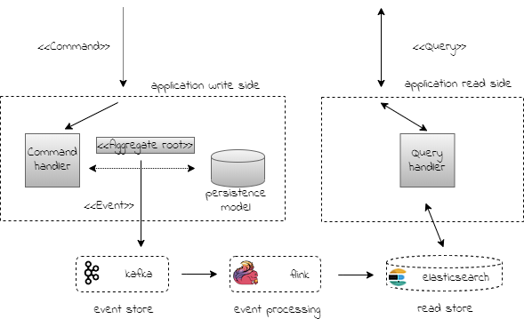

### cqrs-microservices (independently deployable component providing a well-defined service)

This application presents an implementation of the CQRS (Command Query Responsibility Segregation)
application architecture pattern. The Pattern involves splitting an application into two parts
allowing each to be scaled independently.

The write side is all about the business; it does not care about the queries. 
The read side of the application on the other hand issues queries against the
the read store. The read store can be optimized for the query pattern of the application; 
A search application can use Elasticsearch or a graph application can use Neo4j as its read store.
The aim is to maintain a replicate of data in a form that it can be efficiently queried.

#### Overview

 

