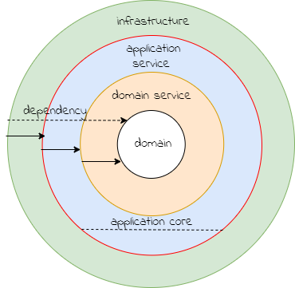

### Package Structure

#### onion architecture
With the Onion Architecture, the system is built around an Application Core, which
is independent of any infrastructure code. This allows the application core to be significantly more 
stable and durable compared to the constantly changing infrastructure technologies 
and frameworks and should therefore serve as the solid foundation for a sustainable 
future of the system. Code in outer rings can access code in inner rings, but not vice versa.
All of this helps us improve the testability and maintainability of the systems.

 

